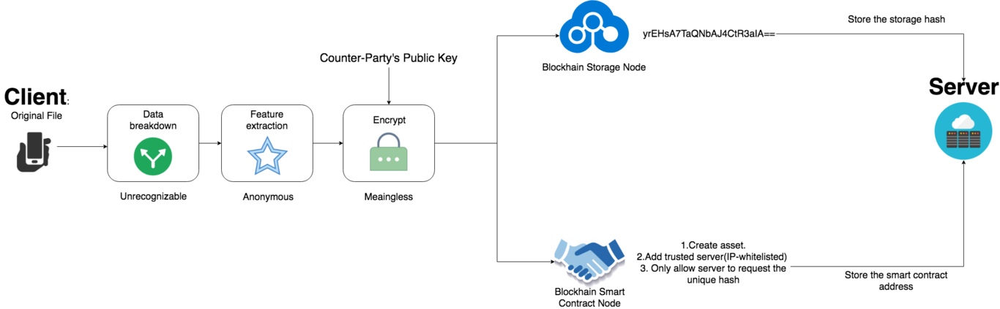

# Deuro gStorage WebUI


> gStorage WebUI is a web interface for [Deuro's gStorage](https://deuro.io). With the interface, you can keep an eye on your hub data, arrange addresses, see associations on a globe outwardly, see your documents, take a gander at your config and logs without expecting to contact the CLI.



# Usage

## Installation and running

```bash
> git clone https://github.com/hao44le/gStorage-web-ui
> cd gStorage-web-ui
> npm install
# Runs server on port 3000.
> npm start
```

# Development

Make sure [node.js](https://nodejs.org/) version 6 and [npm](https://docs.npmjs.com/) version 3+ are installed and in your path.
# License

[MIT License](LICENSE)
